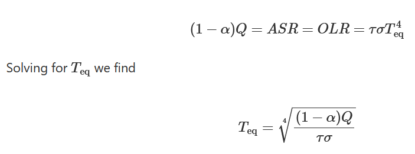
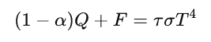
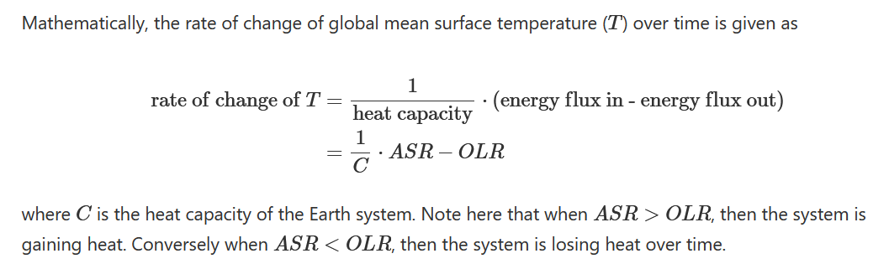
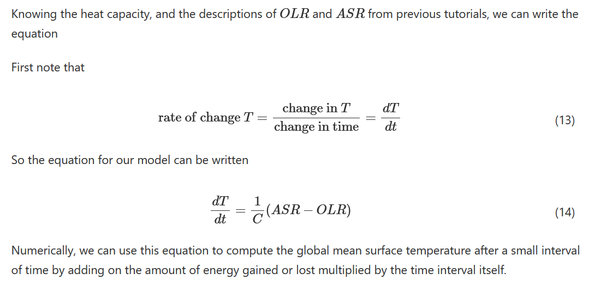
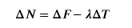

### Tutorial for Temperature energy balance model from:
https://comptools.climatematch.io/tutorials/W1D5_IntroductiontoClimateModeling/student/W1D5_Intro.html

T_eq Equation:

#### Radiative Forcing of Climate Change (we simplified so it is only affected by CO2)
https://www.ipcc.ch/site/assets/uploads/2018/03/TAR-06.pdf

#### Radiative Forcing Impact on Energy Balance Model
https://www.gfy.ku.dk/~kaas/onedmodel/Energybalancemodel.pdf

#### Rate of change of global mean surface tempearture

#### Alternative Formula for energy imbalance (called top-of-atmosphere energy imbalance)

From:
https://www.ipcc.ch/report/ar6/wg1/chapter/chapter-7/#box-7.1
(Called IPCC linear feedback model)
