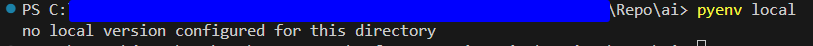
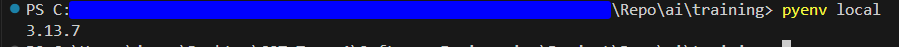

# Python Version

When nagivating into the "training" project directory, pyenv (or pyenv-win) detects the `.python-version` file and automatically switches its local Python intepreter to the version specified in that file (assuming that version is installed via pyenv)

------

Check what installed version of Python pyenv is using (for this project):
```
pyenv local
```

(Should output 3.13.7 if it that version of Python is installed using pyenv)

------

Example:

Outside of project folder



In project folder



